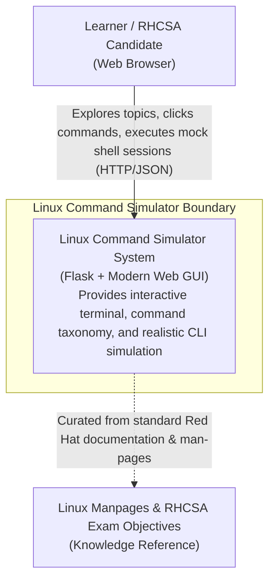
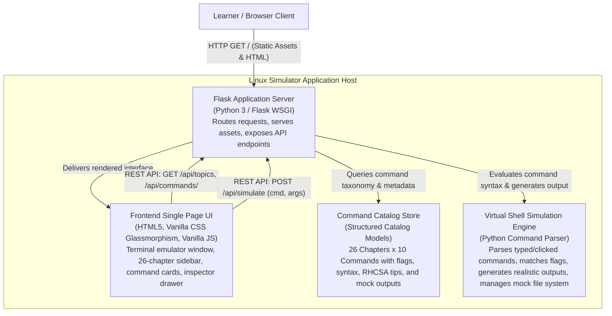
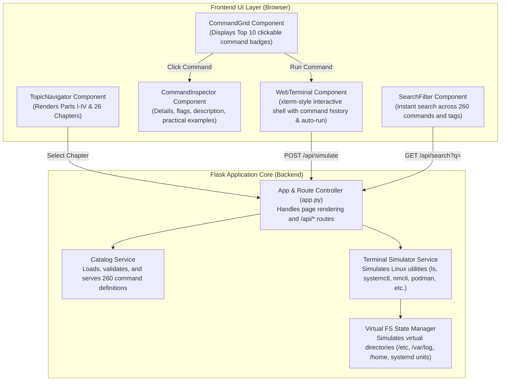
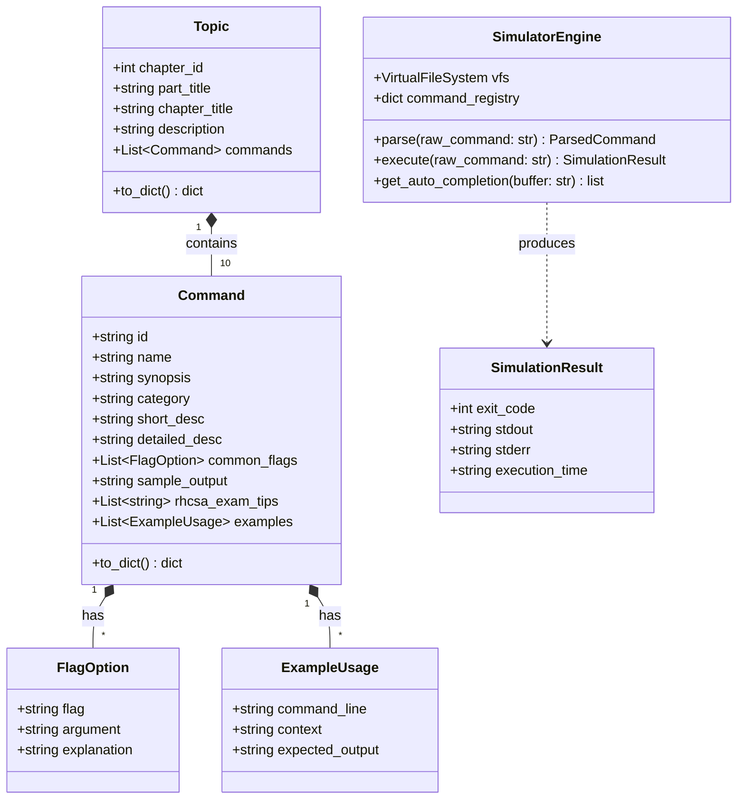
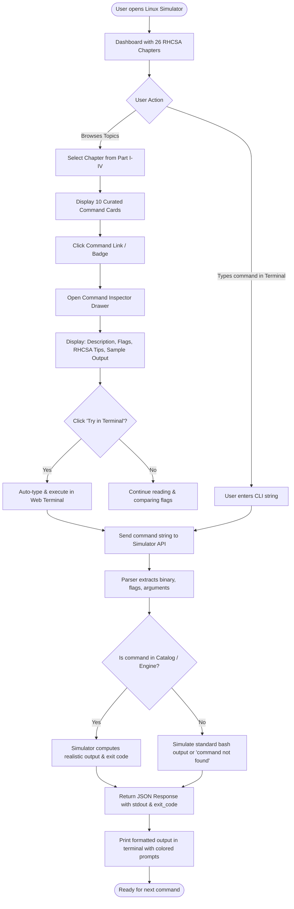

# Linux Command Simulator & RHCSA 9 Learning Hub
## Architecture Plan, C4 Diagrams (L1–L4), Flowcharts & Curriculum Breakdown

This project is a Flask-powered **Linux Simulator and Learning Hub** covering all 26 chapters from the *Red Hat RHCSA 9 Cert Guide (EX200)*, featuring the **Top 10 essential Linux commands per chapter** (260 commands total).

---

## 1. Quick Start

### Prerequisites
- Python 3.8+
- Flask

### Installation & Run
```bash
# Navigate to the project directory
cd /Users/moradi/Documents/Mylab/Topics/07-Automation-Scripts/Linux-command

# Install dependencies
pip install -r requirements.txt

# Run the Flask web application
python3 app.py
```
Then open your browser at: **`http://localhost:5050`** (or `http://127.0.0.1:5050`).

---

## 2. System Architecture & C4 Model

```
Level 1: System Context  ---> Who uses it and what systems it touches
Level 2: Container       ---> Flask app, Frontend UI, Mock Engine, Catalog Store
Level 3: Component       ---> Blueprints, Services, Controller, Parsers
Level 4: Code / Schema   ---> Data models, classes, and command execution flow
```

### 2.1 C4 Level 1: System Context Diagram


### 2.2 C4 Level 2: Container Diagram


### 2.3 C4 Level 3: Component Diagram


### 2.4 C4 Level 4: Code & Data Model Diagram


---

## 3. Operational Flowchart



---

## 4. 26-Chapter Section Breakdown & 260 Commands

### Part I: Performing Basic System Management Tasks

| Chapter | Topic Title | 10 Essential Commands Covered |
|---|---|---|
| **Ch 1** | **Installing Red Hat Enterprise Linux** | `hostnamectl`, `timedatectl`, `localectl`, `subscription-manager`, `uname`, `lsblk`, `fdisk`, `cat /etc/os-release`, `grub2-install`, `lscpu` |
| **Ch 2** | **Using Essential Tools** | `man`, `info`, `help`, `which`, `type`, `history`, `clear`, `echo`, `alias`, `date` |
| **Ch 3** | **Essential File Management Tools** | `ls`, `cd`, `pwd`, `cp`, `mv`, `rm`, `mkdir`, `rmdir`, `touch`, `ln` |
| **Ch 4** | **Working with Text Files** | `cat`, `less`, `head`, `tail`, `grep`, `sed`, `awk`, `cut`, `sort`, `wc` |
| **Ch 5** | **Connecting to Red Hat Enterprise Linux 9** | `ssh`, `scp`, `sftp`, `ssh-keygen`, `ssh-copy-id`, `w`, `who`, `last`, `tmux`, `screen` |
| **Ch 6** | **User and Group Management** | `useradd`, `usermod`, `userdel`, `groupadd`, `groupmod`, `groupdel`, `passwd`, `id`, `chage`, `sudo` |
| **Ch 7** | **Permissions Management** | `chmod`, `chown`, `chgrp`, `umask`, `getfacl`, `setfacl`, `ls -l`, `stat`, `chattr`, `lsattr` |
| **Ch 8** | **Configuring Networking** | `ip addr`, `ip route`, `nmcli connection`, `nmcli device`, `nmtui`, `ping`, `traceroute`, `ss`, `dig`, `curl` |

### Part II: Operating Running Systems

| Chapter | Topic Title | 10 Essential Commands Covered |
|---|---|---|
| **Ch 9** | **Managing Software** | `dnf install`, `dnf remove`, `dnf update`, `dnf search`, `dnf repolist`, `dnf module`, `dnf history`, `rpm -qa`, `rpm -ql`, `rpm -qf` |
| **Ch 10** | **Managing Processes** | `ps aux`, `top`, `htop`, `kill`, `killall`, `pkill`, `pgrep`, `nice`, `renice`, `free -h` |
| **Ch 11** | **Working with Systemd** | `systemctl start`, `systemctl stop`, `systemctl enable`, `systemctl status`, `systemctl mask`, `systemctl isolate`, `systemctl daemon-reload`, `systemctl list-units`, `systemd-analyze`, `default-target` |
| **Ch 12** | **Scheduling Tasks** | `crontab -e`, `crontab -l`, `at`, `atq`, `atrm`, `systemd-run`, `systemctl list-timers`, `anacron`, `batch`, `sleep` |
| **Ch 13** | **Configuring Logging** | `journalctl`, `journalctl -u`, `journalctl -xe`, `journalctl -b`, `logger`, `tail -f /var/log/messages`, `tail -f /var/log/secure`, `rsyslogd`, `logrotate`, `dmesg` |
| **Ch 14** | **Managing Storage** | `lsblk`, `fdisk`, `gdisk`, `parted`, `mkfs.xfs`, `mkfs.ext4`, `mount`, `umount`, `blkid`, `df -h` |
| **Ch 15** | **Managing Advanced Storage** | `pvcreate`, `vgcreate`, `lvcreate`, `pvs`, `vgs`, `lvs`, `lvextend`, `lvreduce`, `stratis`, `vdo` |

### Part III: Performing Advanced System Administration Tasks

| Chapter | Topic Title | 10 Essential Commands Covered |
|---|---|---|
| **Ch 16** | **Basic Kernel Management** | `uname -r`, `lsmod`, `modinfo`, `modprobe`, `insmod`, `rmmod`, `sysctl`, `sysctl -p`, `sysctl -a`, `dracut` |
| **Ch 17** | **Managing & Understanding Boot Procedure** | `grub2-mkconfig`, `grub2-editenv`, `systemctl get-default`, `systemctl set-default`, `systemctl emergency`, `systemctl rescue`, `reboot`, `poweroff`, `journalctl -b`, `kexec` |
| **Ch 18** | **Essential Troubleshooting Skills** | `journalctl -p err`, `strace`, `lsof`, `vmstat`, `iostat`, `uptime`, `dmesg -T`, `sosreport`, `tcpdump`, `find / -perm -4000` |
| **Ch 19** | **Bash Shell Scripting & Automation** | `bash`, `chmod +x`, `read`, `test / [ ]`, `expr`, `source`, `export`, `env`, `case`, `for / while` |

### Part IV: Managing Network Services

| Chapter | Topic Title | 10 Essential Commands Covered |
|---|---|---|
| **Ch 20** | **Configuring SSH** | `ssh-keygen -t rsa`, `ssh-copy-id`, `sshd -t`, `cat ~/.ssh/authorized_keys`, `scp`, `sftp`, `ssh -v`, `systemctl restart sshd`, `ssh-add`, `ssh-agent` |
| **Ch 21** | **Managing Apache HTTP Services** | `systemctl status httpd`, `apachectl configtest`, `curl -I localhost`, `firewall-cmd --add-service=http`, `cat /var/log/httpd/access_log`, `cat /var/log/httpd/error_log`, `httpd -v`, `httpd -M`, `semanage port -l`, `restorecon -Rv /var/www/html` |
| **Ch 22** | **Managing SELinux** | `getenforce`, `setenforce`, `sestatus`, `ls -Z`, `ps -eZ`, `semanage fcontext`, `restorecon -v`, `semanage port`, `sealert`, `ausearch` |
| **Ch 23** | **Configuring a Firewall** | `firewall-cmd --state`, `firewall-cmd --get-active-zones`, `firewall-cmd --add-service`, `firewall-cmd --add-port`, `firewall-cmd --permanent`, `firewall-cmd --reload`, `firewall-cmd --list-all`, `firewall-cmd --remove-service`, `iptables-save`, `nft list ruleset` |
| **Ch 24** | **Accessing Network Storage (NFS/CIFS)** | `mount -t nfs`, `showmount -e`, `exportfs -v`, `cat /etc/exports`, `smbclient -L`, `mount -t cifs`, `systemctl status autofs`, `systemctl status nfs-server`, `rpcinfo -p`, `df -hT` |
| **Ch 25** | **Configuring Time Services** | `chronyc sources -v`, `chronyc tracking`, `chronyc sourcestats`, `timedatectl status`, `timedatectl set-ntp true`, `systemctl status chronyd`, `cat /etc/chrony.conf`, `hwclock`, `date -R`, `tzselect` |
| **Ch 26** | **Managing Containers with Podman** | `podman run`, `podman ps -a`, `podman images`, `podman pull`, `podman stop`, `podman rm`, `podman generate systemd`, `podman volume ls`, `podman build`, `skopeo inspect` |


---

## 5. Project Directory Structure
```
Linux-command/
├── README.md                      # Architecture, C4 diagrams, and curriculum
├── requirements.txt               # Flask dependencies
├── app.py                         # Main Flask application and REST routes
├── data/
│   ├── __init__.py
│   └── commands_data.py           # 26 chapters x 10 commands knowledge database
├── services/
│   ├── __init__.py
│   ├── catalog_service.py         # Topic catalog and search
│   └── simulator_service.py       # Simulation parser and mock terminal executor
├── static/
│   ├── css/
│   │   └── style.css              # Dark glassmorphic modern UI
│   └── js/
│       └── app.js                 # Terminal emulation & interactive drawer UI
└── templates/
    └── index.html                 # Main dashboard interface
```
