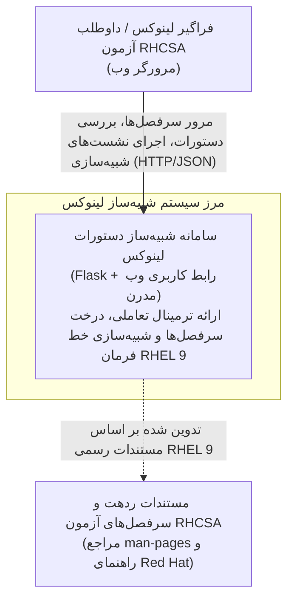
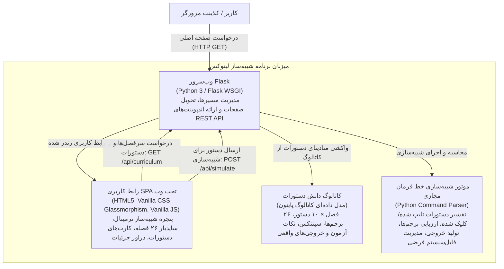
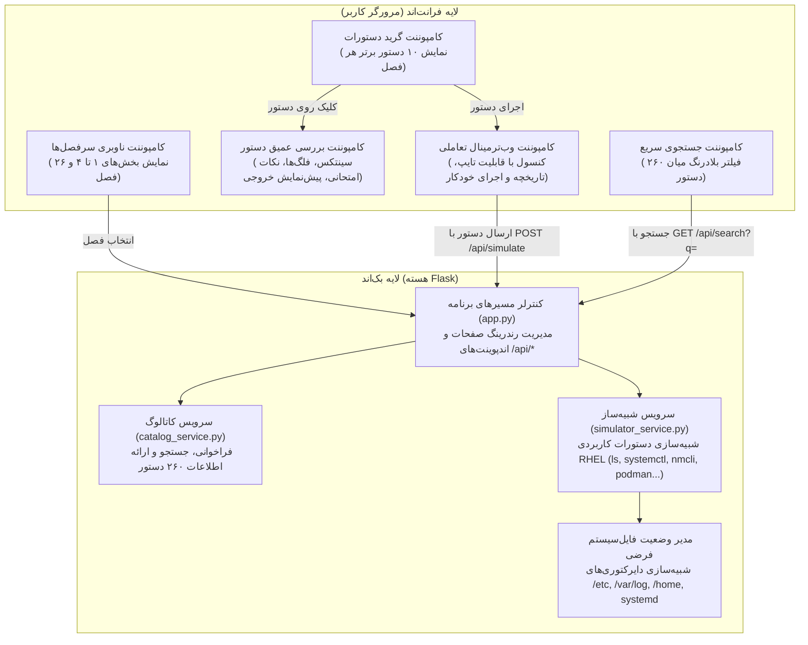
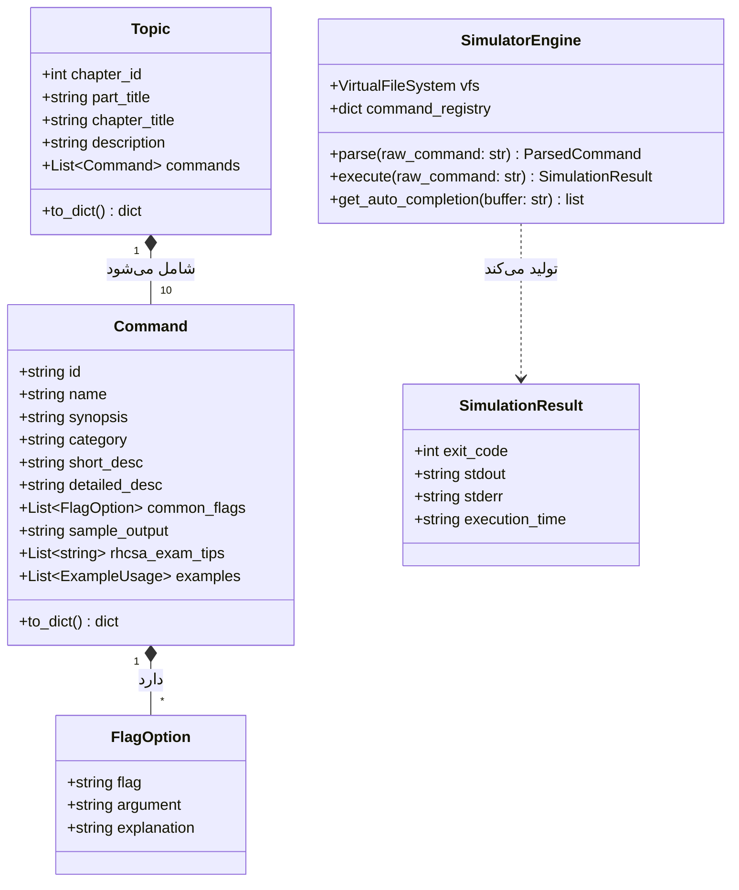
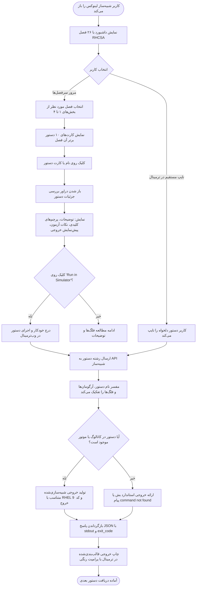

# شبیه‌ساز تعاملی دستورات لینوکس و مرجع آزمون RHCSA 9
## نقشه معماری، دیاگرام‌های مدل C4 (سطوح ۱ تا ۴)، فلوچارت عملیاتی و سرفصل‌های جامع

[🇺🇸 English Version](README.md) | [🇮🇷 نسخه فارسی](README_FA.md)

---

این پروژه یک **شبیه‌ساز تعاملی خط فرمان لینوکس و پلتفرم یادگیری جامع** مبتنی بر فریم‌ورک Flask است که تمامی ۲۶ فصل کتاب رسمی آمادگی آزمون ردهت *(Red Hat RHCSA 9 Cert Guide - EX200)* را پوشش داده و برای هر فصل، **۱۰ دستور حیاتی و پرتکرار** (در مجموع ۲۶۰ دستور کلیدی) را همراه با پرچم‌ها (Flags)، سناریوهای آزمون، نکات کاربردی و خروجی شبیه‌سازی‌شده ارائه می‌دهد.

📁 **مسیر محلی پروژه:**  
`/Users/moradi/Documents/Mylab/Topics/07-Automation-Scripts/Linux-command`

---

## ۱. آنچه ساخته و تحویل داده شد

### 📦 راه‌اندازی و مقداردهی اولیه مخزن گیت (Git)
- ایجاد و پیکربندی مخزن محلی Git با شاخه پیش‌فرض `main`.
- کامیت کامل سورس‌کد، ساختار داده‌ها، فایل‌های پیکربندی و تست‌ها.
- اتصال مستقیم به مخزن ریموت گیت‌هاب: [smorad993/rhcsa9-linux-simulator](https://github.com/smorad993/rhcsa9-linux-simulator).

### 📚 پوشش جامع ۲۶ فصل و ۲۶۰ دستور کلیدی لینوکس
- **بخش اول: وظایف پایه مدیریت سیستم (فصل‌های ۱ تا ۸):** `hostnamectl`, `timedatectl`, `localectl`, `uname`, `lsblk`, `fdisk`, `man`, `ls`, `grep`, `ssh`, `useradd`, `chmod`, `setfacl`, `nmcli`, `ip`, `ss` و غیره.
- **بخش دوم: مدیریت و نگهداری سیستم‌های در حال کار (فصل‌های ۹ تا ۱۵):** `dnf`, `rpm`, `ps aux`, `top`, `kill`, `systemctl`, `crontab`, `journalctl`, `mkfs.xfs`, `mount`, `blkid`, `lvextend`, `stratis` و غیره.
- **بخش سوم: مدیریت پیشرفته سیستم (فصل‌های ۱۶ تا ۱۹):** `uname -r`, `lsmod`, `modprobe`, `sysctl`, `grub2-mkconfig`, `systemctl set-default`, `strace`, `lsof`, `tcpdump`, اسکریپت‌نویسی شل با `bash` و غیره.
- **بخش چهارم: مدیریت سرویس‌های شبکه (فصل‌های ۲۰ تا ۲۶):** امن‌سازی SSH، وب‌سرور آپاچی `httpd`، مدیریت امنیتی SELinux (`sestatus`, `semanage fcontext`, `restorecon`, `setsebool`)، فایروال با `firewall-cmd`، اشتراک‌گذاری فایل تحت شبکه NFS/CIFS (`showmount`, `autofs`)، همگام‌سازی زمان با Chrony، و مدیریت کانتینرها با پودمن (`podman run`, `podman generate systemd`).

### 🖥️ رابط کاربری وب مدرن (GUI) و شبیه‌ساز تعاملی ترمینال
- **طراحی شیشه‌ای تیره مدرن (Dark Glassmorphism):** پیاده‌سازی شده با Vanilla CSS استاندارد، تایپوگرافی چشم‌نواز Outfit و JetBrains Mono، انیمیشن‌های ملایم و رنگ‌بندی الهام‌گرفته از Red Hat و ترمینال‌های لینوکس.
- **سایدبار موضوعی ۲۶ فصله:** دسته‌بندی شده در ۴ بخش اصلی برای جابه‌جایی سریع بین سرفصل‌ها.
- **کارت‌های تعاملی ۱۰ دستور برتر:** نمایش نشانه‌ها، نام دستور، سینتکس و خلاصه‌ی کاربرد.
- **پنل بررسی دستور (Command Inspector):** نمایش فرمت دقیق دستور همراه با کلید کپی، توضیحات جامع عملکرد، جدول پرچم‌ها و سوئیچ‌های ضروری، کادر اختصاصی **نکات طلایی آزمون بین‌المللی RHCSA EX200**، و پیش‌نمایش خروجی واقعی.
- **کنسول وب ترمینال زنده:** دارای اعلان خط فرمان لینوکس ردهت (`[root@rhel9-node1 ~]#`)، امکان تایپ آزادانه دستورات، ثبت تاریخچه (با کلیدهای جهت‌نمای بالا/پایین `↑` / `↓`)، تکمیل خودکار با Tab، شبیه‌سازی فایل سیستم مجازی و دکمه تک‌کلیکی **"▶ Run in Simulator"**.
- **جستجوی فوری (Instant Search):** باز شدن پنجره جستجو با کلید میانبر `Ctrl + K` یا `Cmd + K` برای جستجو میان کل ۲۶۰ دستور، پرچم‌ها و توضیحات.

### 🧪 تست خودکار و تضمین کیفیت
- دارای مجموعه تست واحد اختصاصی (`test_app.py`) با قبولی ۱۰۰٪ (**۶ از ۶ تست پاس شد**).
- اعتبارسنجی تمام ۲۶ فصل، ۲۶۰ دستور، مسیرهای REST API و موتور شبیه‌سازی.

---

## ۲. راهنمای شروع سریع و نحوه دسترسی

### دسترسی به سامانه در حال اجرا
سرور Flask هم‌اکنون به صورت پس‌زمینه فعال است. کافی است آدرس زیر را در مرورگر خود باز کنید:  
👉 **[http://localhost:5050](http://localhost:5050)** (یا `http://127.0.0.1:5050`)

*(پورت `5050` برای جلوگیری از تداخل با سرویس AirPlay / ControlCenter در سیستم‌عامل مک در نظر گرفته شده است).*

### دستورات راه‌اندازی دستی در آینده
```bash
# ورود به پوشه پروژه
cd /Users/moradi/Documents/Mylab/Topics/07-Automation-Scripts/Linux-command

# فعال‌سازی محیط مجازی پایتون
source venv/bin/activate

# نصب وابستگی‌ها (در صورت نیاز)
pip install -r requirements.txt

# اجرای تست‌های سامانه
python3 test_app.py

# اجرای سرور وب شبیه‌ساز
python3 app.py
```

---

## ۳. معماری سیستم و مدل C4

```
سطح ۱: زمینه سیستم (System Context)  ---> چه کسانی و چه سیستم‌هایی با سامانه در تعامل هستند
سطح ۲: کانتینر (Container)           ---> برنامه Flask، فرانت‌اند وب، موتور شبیه‌ساز، دیتابیس کاتالوگ
سطح ۳: کامپوننت (Component)          ---> سرویس‌ها، کنترلرها، مفسر دستورات، فایل‌سیستم مجازی
سطح ۴: کد و ساختار داده (Code)       ---> کلاس‌های پایتون، مدل‌ها و جریان اجرای شبیه‌سازی
```

### ۳.۱ سطح ۱ مدل C4: دیاگرام زمینه سیستم (System Context)


### ۳.۲ سطح ۲ مدل C4: دیاگرام کانتینرها (Container)


### ۳.۳ سطح ۳ مدل C4: دیاگرام کامپوننت‌ها (Component)


### ۳.۴ سطح ۴ مدل C4: دیاگرام کد و ساختار کلاس‌ها (Code & Schema)


---

## ۴. فلوچارت عملیاتی نحوه کارکرد شبیه‌ساز



---

## ۵. جدول تفکیک ۲۶ فصل و ۲۶۰ دستور کلیدی

### بخش اول: وظایف پایه مدیریت سیستم (Part I)

| فصل | عنوان فصل | ۱۰ دستور حیاتی پوشش داده شده |
|---|---|---|
| **فصل ۱** | **نصب Red Hat Enterprise Linux** | `hostnamectl`, `timedatectl`, `localectl`, `subscription-manager`, `uname`, `lsblk`, `fdisk`, `cat /etc/os-release`, `grub2-install`, `lscpu` |
| **فصل ۲** | **استفاده از ابزارهای ضروری خط فرمان** | `man`, `info`, `help`, `which`, `type`, `history`, `clear`, `echo`, `alias`, `date` |
| **فصل ۳** | **ابزارهای حیاتی مدیریت فایل و پوشه** | `ls`, `cd`, `pwd`, `cp`, `mv`, `rm`, `mkdir`, `rmdir`, `touch`, `ln` |
| **فصل ۴** | **کار با فایل‌های متنی و فیلترها** | `cat`, `less`, `head`, `tail`, `grep`, `sed`, `awk`, `cut`, `sort`, `wc` |
| **فصل ۵** | **اتصال امن به RHEL 9 از راه دور** | `ssh`, `scp`, `sftp`, `ssh-keygen`, `ssh-copy-id`, `w`, `who`, `last`, `tmux`, `screen` |
| **فصل ۶** | **مدیریت کاربران و گروه‌ها** | `useradd`, `usermod`, `userdel`, `groupadd`, `groupmod`, `groupdel`, `passwd`, `id`, `chage`, `sudo` |
| **فصل ۷** | **مدیریت مجوزها و دسترسی‌ها (Permissions & ACL)** | `chmod`, `chown`, `chgrp`, `umask`, `getfacl`, `setfacl`, `ls -l`, `stat`, `chattr`, `lsattr` |
| **فصل ۸** | **پیکربندی شبکه در RHEL 9** | `ip addr`, `ip route`, `nmcli connection`, `nmcli device`, `nmtui`, `ping`, `traceroute`, `ss`, `dig`, `curl` |

### بخش دوم: مدیریت سیستم‌های در حال کار (Part II)

| فصل | عنوان فصل | ۱۰ دستور حیاتی پوشش داده شده |
|---|---|---|
| **فصل ۹** | **مدیریت نرم‌افزارها و پکیج‌ها (DNF & RPM)** | `dnf install`, `dnf remove`, `dnf update`, `dnf search`, `dnf repolist`, `dnf module`, `dnf history`, `rpm -qa`, `rpm -ql`, `rpm -qf` |
| **فصل ۱۰** | **مدیریت و نظارت بر پروسه‌ها (Processes)** | `ps aux`, `top`, `htop`, `kill`, `killall`, `pkill`, `pgrep`, `nice`, `renice`, `free -h` |
| **فصل ۱۱** | **کار با سرویس‌ها و Systemd** | `systemctl start`, `systemctl stop`, `systemctl enable`, `systemctl status`, `systemctl mask`, `systemctl isolate`, `systemctl daemon-reload`, `systemctl list-units`, `systemd-analyze`, `default-target` |
| **فصل ۱۲** | **زمان‌بندی وظایف (Cron, At & Timers)** | `crontab -e`, `crontab -l`, `at`, `atq`, `atrm`, `systemd-run`, `systemctl list-timers`, `anacron`, `batch`, `sleep` |
| **فصل ۱۳** | **پیکربندی و تحلیل لاگ‌ها (Logging & Journald)** | `journalctl`, `journalctl -u`, `journalctl -xe`, `journalctl -b`, `logger`, `tail -f /var/log/messages`, `tail -f /var/log/secure`, `rsyslogd`, `logrotate`, `dmesg` |
| **فصل ۱۴** | **مدیریت دیسک و فضای ذخیره‌سازی پایه** | `lsblk`, `fdisk`, `gdisk`, `parted`, `mkfs.xfs`, `mkfs.ext4`, `mount`, `umount`, `blkid`, `df -h` |
| **فصل ۱۵** | **مدیریت ذخیره‌سازی پیشرفته (LVM & Stratis)** | `pvcreate`, `vgcreate`, `lvcreate`, `pvs`, `vgs`, `lvs`, `lvextend`, `lvreduce`, `stratis`, `vdo` |

### بخش سوم: مدیریت پیشرفته سیستم (Part III)

| فصل | عنوان فصل | ۱۰ دستور حیاتی پوشش داده شده |
|---|---|---|
| **فصل ۱۶** | **مدیریت هسته لینوکس و ماژول‌ها (Kernel & Sysctl)** | `uname -r`, `lsmod`, `modinfo`, `modprobe`, `insmod`, `rmmod`, `sysctl`, `sysctl -p`, `sysctl -a`, `dracut` |
| **فصل ۱۷** | **فرایند بوت سیستم و بازیابی رمز عبور روت** | `grub2-mkconfig`, `grub2-editenv`, `systemctl get-default`, `systemctl set-default`, `systemctl emergency`, `systemctl rescue`, `reboot`, `poweroff`, `journalctl -b`, `kexec` |
| **فصل ۱۸** | **مهارت‌های حیاتی عیب‌یابی (Troubleshooting)** | `journalctl -p err`, `strace`, `lsof`, `vmstat`, `iostat`, `uptime`, `dmesg -T`, `sosreport`, `tcpdump`, `find / -perm -4000` |
| **فصل ۱۹** | **اتوماسیون و اسکریپت‌نویسی شل با بش (Bash Scripting)** | `bash`, `chmod +x`, `read`, `test / [ ]`, `expr`, `source`, `export`, `env`, `case`, `for / while` |

### بخش چهارم: مدیریت سرویس‌های شبکه (Part IV)

| فصل | عنوان فصل | ۱۰ دستور حیاتی پوشش داده شده |
|---|---|---|
| **فصل ۲۰** | **پیکربندی و امن‌سازی SSH** | `ssh-keygen -t rsa`, `ssh-copy-id`, `sshd -t`, `cat ~/.ssh/authorized_keys`, `scp`, `sftp`, `ssh -v`, `systemctl restart sshd`, `ssh-add`, `ssh-agent` |
| **فصل ۲۱** | **راه‌اندازی و مدیریت وب‌سرور آپاچی (HTTPD)** | `systemctl status httpd`, `apachectl configtest`, `curl -I localhost`, `firewall-cmd --add-service=http`, `cat /var/log/httpd/access_log`, `cat /var/log/httpd/error_log`, `httpd -v`, `httpd -M`, `semanage port -l`, `restorecon -Rv /var/www/html` |
| **فصل ۲۲** | **امنیت لینوکس با SELinux** | `getenforce`, `setenforce`, `sestatus`, `ls -Z`, `ps -eZ`, `semanage fcontext`, `restorecon -v`, `semanage port`, `sealert`, `ausearch` |
| **فصل ۲۳** | **پیکربندی فایروال (Firewalld)** | `firewall-cmd --state`, `firewall-cmd --get-active-zones`, `firewall-cmd --add-service`, `firewall-cmd --add-port`, `firewall-cmd --permanent`, `firewall-cmd --reload`, `firewall-cmd --list-all`, `firewall-cmd --remove-service`, `iptables-save`, `nft list ruleset` |
| **فصل ۲۴** | **دسترسی به فضاهای اشتراکی شبکه (NFS / CIFS / Autofs)** | `mount -t nfs`, `showmount -e`, `exportfs -v`, `cat /etc/exports`, `smbclient -L`, `mount -t cifs`, `systemctl status autofs`, `systemctl status nfs-server`, `rpcinfo -p`, `df -hT` |
| **فصل ۲۵** | **پیکربندی سرویس‌های همگام‌سازی زمان (Chrony & NTP)** | `chronyc sources -v`, `chronyc tracking`, `chronyc sourcestats`, `timedatectl status`, `timedatectl set-ntp true`, `systemctl status chronyd`, `cat /etc/chrony.conf`, `hwclock`, `date -R`, `tzselect` |
| **فصل ۲۶** | **مدیریت کانتینرها با پودمن (Podman & Rootless Containers)** | `podman run`, `podman ps -a`, `podman images`, `podman pull`, `podman stop`, `podman rm`, `podman generate systemd`, `podman volume ls`, `podman build`, `skopeo inspect` |

---

## ۶. ساختار فایل‌ها و دایرکتوری‌های پروژه

```
Linux-command/
├── README.md                      # مستندات و راهنمای جامع انگلیسی
├── README_FA.md                   # مستندات و راهنمای جامع فارسی
├── requirements.txt               # وابستگی‌های پایتون و Flask
├── app.py                         # هسته وب‌سرور Flask و روت‌های API
├── test_app.py                    # مجموعه تست خودکار اعتبارسنجی
├── data/
│   ├── __init__.py
│   ├── chapters_part1.py          # فصل‌های ۱ تا ۸ (۸۰ دستور)
│   ├── chapters_part2.py          # فصل‌های ۹ تا ۱۵ (۷۰ دستور)
│   ├── chapters_part3.py          # فصل‌های ۱۶ تا ۱۹ (۴۰ دستور)
│   ├── chapters_part4.py          # فصل‌های ۲۰ تا ۲۶ (۷۰ دستور)
│   └── commands_data.py           # پایگاه دانش تجمیعی و جستجو (۲۶۰ دستور)
├── services/
│   ├── __init__.py
│   ├── catalog_service.py         # سرویس فیلتر و جستجوی کاتالوگ
│   └── simulator_service.py       # موتور شبیه‌ساز تعاملی ترمینال و فایل‌سیستم فرضی
├── static/
│   ├── css/
│   │   └── style.css              # استایل‌های مدرن شیشه‌ای تیره (Glassmorphism)
│   └── js/
│       └── app.js                 # منطق تعاملی کلاینت، شبیه‌ساز خط فرمان و جستجو
└── templates/
    └── index.html                 # قالب اصلی برنامه وب
```
